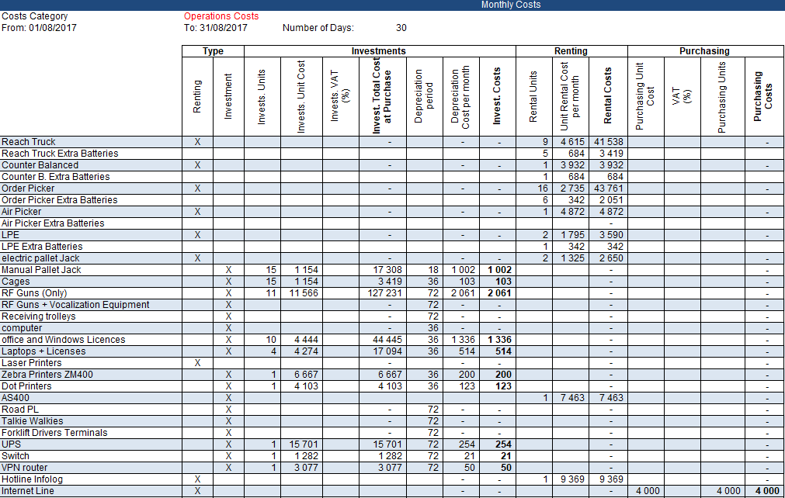

# Automate Accounting Tasks using Python 🐍
Build solutions to automate repetitive tasks for Financial Audits to improve finance colleagues' productivity.

## Problem Statement
Imagine working as an analyst for a logistics company and the Finance Team requests your support to build a model to predict the P&L of the warehouse operations.  

## Objective
Build a tool that will automatically extract data from each of these 720 Excel files, format it and combine everything in one report.  

## Solution
A python script that will:
1. Open every Excel report located in a folder
2. Process and clean data
3. Build the monthly report following the format presented above
4. Merge monthly report with the global dataframe
5. Save final results in an Excel file

## About me 😎
Data Science and Artificial Intelligence Sophomore aspired to be an analyst and interested in the logistics and supply chain industry.
