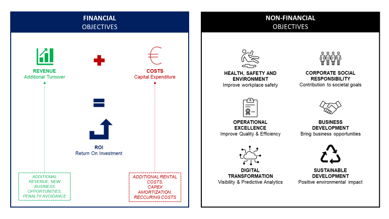

# Automate Budget Planning Using Linear Programming 💹
Companies need to invest in IT capabilities, equipment or warehouse space to improve the efficiency of their operations.

## Problem Statement ❓
Because of budget constraints, they need to decide for which projects the organization will allocate resources.
 
## Objective 🎯
In this project, I will design a linear programming model with Python to automate this decision-making process.
For each warehouse, the manager lists all projects that need capital. In the application form, information that can help justify this investment are:
- Which customer will be benefitted?
- What is the estimated cost per year?
- What is the estimated ROI after 3 years?

## Management guidelines
- Sustainable development
- Digital transformation
- Operational excellence

## Idea 💡
I will build 2 models, each for different purposes:
1. Maximize ROI
2. Management Guidelines

## References 
- Computational Infrastructure for Operations Research, Optimization with PuLP

## About me 😎
Data Science and Artificial Intelligence Sophomore aspired to be an analyst and interested in the logistics and supply chain industry.
