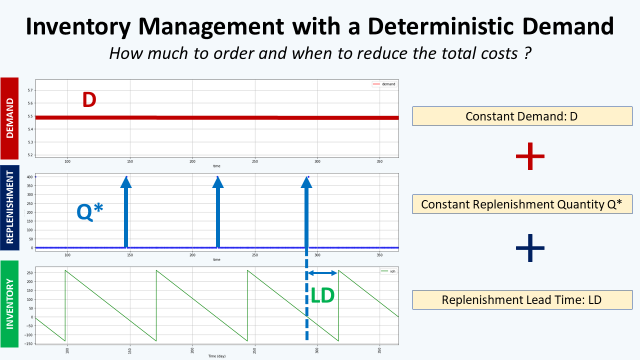

# Inventory Management for Retail — Deterministic Demand📈
For most retailers, inventory management systems take a fixed, rule-based approach to forecast and replenish orders.  
Considering the distribution of the demand, the objective is to build a replenishment policy that will minimize our:  
- **Ordering Costs**: fixed cost to place an order due to administrative costs, system maintenance or manufacturing costs. *(Unit: Euros/Order)*
- **Holding Costs**: costs required to hold your inventory (storage, insurance, and capital costs) *(Unit: Euros/unit x time)*
- **Shortage/Stock-out Costs**: the costs of not having enough inventory to meet the customer demand (Lost Sales/Penalty) *(Unit: Euros/Unit)*

## Problem Statement
As an Inventory Manager of a mid-size retail chain, I am in charge of setting the replenishment quantity in the enterprise resource planning (ERP). The store manager reported that our stores are losing sales due to stock-outs. For each stock-keeping unit (SKU), I build a simple simulation model to test several inventory rules and estimate the impact on:
- **Total Costs**: how much does it cost to receive, store and sell this product?
- **Shortages**: what is the percentage of lost sales due to stock-out?
---
In this notebook, we set some variables into constants:
- **Total demand per year**: D = 2000
- **Number of days of sales per year**: T_total = 365
- **Customer demand per day**: D_day = D/T_total
- **Purchase cost of the product**: c = 50
- **Cost of placing an order**: c_t = 500
- **Holding cost**: c_e = 0.25*c
- **Selling Price**: p = 75
- **Lead Time between ordering and receiving**: LD
- **Cost of shortage**: c_s = 12
---
Notations:
- **Quantity per replenishment order**: Q
- **Expected number of units short**: E
- **Total cost (Ordering, Holding and Shortage)**: $$TC(Q) = cD + c_{T}(\frac{D}{Q}) + c_{e}(\frac{Q}{2} + c_{s}) $$
- **Replenishment cycle time**: T
- **Replenishment orders per year**: $$N = \frac{1}{T}$$
- **Inventory on hand at each**: IOH
---
## Objective
1. Visualize the current rule used by the store manager
2. Calculate the **EOQ** and simulate the impact
3. Visualize the impact of **lead time** between ordering and receiving
4. Real-Time visualization of **COGS** for each rule

## Dataset
This analysis is based on the M5 Forecasting dataset of Walmart stores sales record [(Link)](https://www.kaggle.com/c/m5-forecasting-accuracy)

## About me 😎
Data Science and Artificial Intelligence Sophomore aspired to be an analyst and interested in the logistics and supply chain industry.
