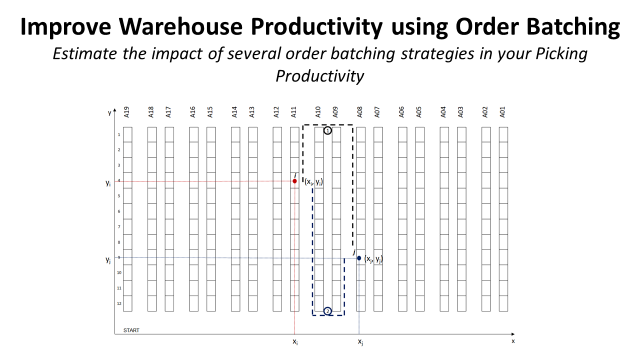

# Improve Warehouse Productivity using Order Batching with Python 🚀

## Problem Statement
In a distribution centre (DC), walking from one location to another during the picking route can account for 60% to 70% of the operator's working time.
Reducing this walking time is the most effective way to increase your DC overall productivity.

## Objective

Design a simulation model to estimate the impact of several Single Picker Routing Problem strategies in the picking productivity.
Single Picker Routing Problem (SPRP) is used to determine the minimum route in the picking process to prepare one or several orders.

## Dataset
This analysis is based on the M5 Forecasting dataset of Walmart stores sales record [(Link)](https://www.kaggle.com/c/m5-forecasting-accuracy)

## Next chapters 👣
- Orders can be grouped by [geographical clusters]() of Picking Locations to reduce pickers’ walking distance
- [Next closest Location]() strategy has its limits that can be easily pointed out by picking route records

## About me 😎
Data Science and Artificial Intelligence Sophomore aspired to be an analyst and interested in the logistics and supply chain industry.
