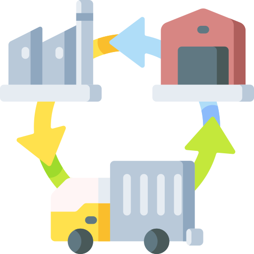

  

<h2 align="center">
  Supply chain projects
</h2>

### Inventory Management for Retail 🛒
- Inventory Management for Retail — Deterministic Demand: [Github Repository](https://github.com/lordAaron0121/Supply-Chain-Optimization/tree/main/Inventory%20Management%20for%20Retail%20%E2%80%94%20Deterministic%20Demand)
- Product Segmentation for Retail: [Github Repository](https://github.com/lordAaron0121/Supply-Chain-Optimization/tree/main/Product%20segmentation%20for%20Retail)
- 
### Supply Chain Management 🏭
- Raw Materials Optimization for Food Manufacturing using Linear Programming with Python: [Github Repository](https://github.com/lordAaron0121/Supply-Chain-Optimization/tree/main/Raw%20Materials%20Optimization%20for%20Food%20Manufacturing)
- Supply Planning using Linear Programming with Python: [Github Repository](https://github.com/lordAaron0121/Supply-Chain-Optimization/tree/main/Supply%20Planning%20using%20Linear%20Programming)
    
### Supply Chain Transactional Processes Automation (RPA) 🤖
- Use Python to Design Automation Tools for Excel Users: [Github Repository](https://github.com/lordAaron0121/Supply-Chain-Optimization/tree/main/Excel%20Automation)
- Automate Accounting Tasks using Python: [Github Repository](https://github.com/lordAaron0121/Supply-Chain-Optimization/tree/main/Automate%20Accounting%20Tasks)
- Automate Budget Planning using linear programming: [Github Repository](https://github.com/lordAaron0121/Supply-Chain-Optimization/tree/main/Budget%20Planning%20Automation)
- Maximize your Business Profitability with Python Linear Programming: [Github Repository](https://github.com/lordAaron0121/Supply-Chain-Optimization/tree/main/Maximize%20Business%20Profitability)

### Supply Chain Sustainability 🌲
- Supply Chain Sustainability Reporting with Python: [Github Repository](https://github.com/lordAaron0121/Supply-Chain-Optimization/tree/main/Supply%20Chain%20Sustainability%20Reporting)

### References 🥰
- [Samir Saci's personal website](https://www.samirsaci.com/)
