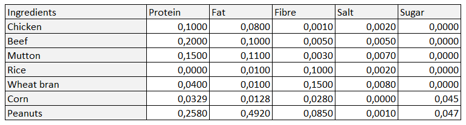
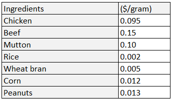

# Raw Materials Optimization for Food Manufacturing 🍔
As the R&D manager of a large food manufacturer, design a recipe for a new cheap and healthy meal bar. 
The objective is to create an optimal recipe of meal bar that meets specific nutritional requirements.

## Problem Statement
7 ingredients are available:
- meat: chicken, beef, mutton
- non-meat: rice, corn, wheat bran, peanuts
These ingredients have different nutrition facts different costs per gram.

