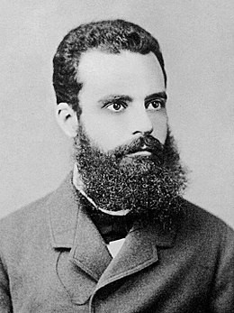

# Reduce Warehouse Space using Pareto Principle ✌️
An Italian economist named Vilfredo Pareto developed 1906 a mathematical formula to describe the distribution of wealth in Italy. He discovered that 80% of the wealth belonged to 20% of the population. 

## Objective 🎯
How the 80/20 rule implemented using python can optimize your layout, reduce space utilization and improve the picking productivity. When translated intto logistic:
- 80% of your company revenue is made from 20% of your reference
- 80% of your volume is picked in 20% of your picking locations
- 80% of your replenishment volume will be performed on 20% of your picking locations

## References
- Kaggle Dataset, Store Item Demand Forecasting Challenge

## About me 😎
Data Science and Artificial Intelligence Sophomore aspired to be an analyst and interested in the logistics and supply chain industry.
