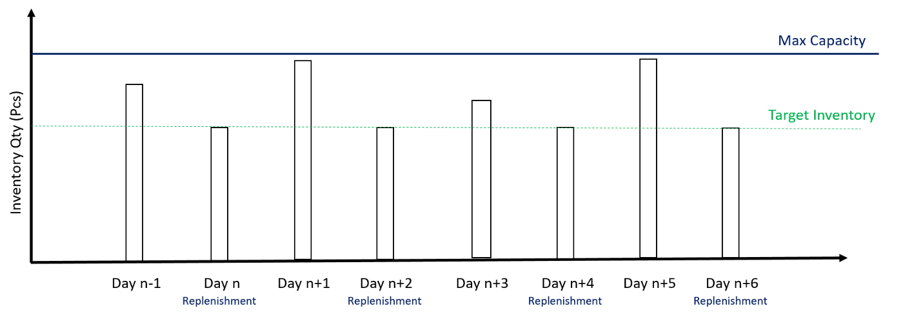
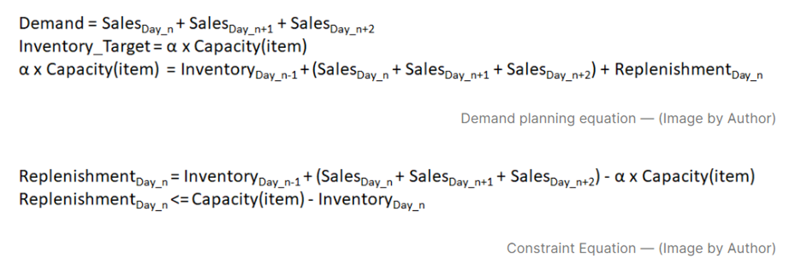

# Store Delivery Scheduling using Machine Learning 🚚
Due to lead-time requirements, replenishment orders have to be created by the store the day before after store closing.

## Problem Statement ❓
Design an algorithm that measures the inventory level before store opens (10 AM), after store closes and before delivery (if it's replenishment day) (8 PM)

1. Prepare replenishment on day n-1
2. Fix inventory level before delivery for day n+2
3. Demand planning: replenishment for day n needs to cover the demand of day n, n+1, n+2 to reach the inventory level target at the end of day n+2 before the next delivery
4. Constraint: Inventory after delivery must be lower than the maximum capacity

## Objective 🎯
Design replenishment strategies to optimize inventory and reduce number of deliveries from the warehouse.

## Dataset 
This notebook uses a dataset from the Kaggle challenge: [Store Item Demand Forecasting Challenge](https://www.kaggle.com/c/demand-forecasting-kernels-only)

## References
- Store Item Demand Forecasting Challenge (Kaggle)

## About me 😎
Data Science and Artificial Intelligence Sophomore aspired to be an analyst and interested in the logistics and supply chain industry.
