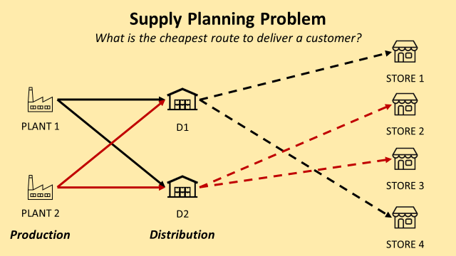

# Supply Planning using Linear Programming 🌎
Supply planning is the process of managing manufactured inventory to fulfil the requirements created from the demand plan.
Oftentimes, we are given feedbacks that the distribution costs are too high. This is mainly due to the stock allocation rules.

## The distribution network
- 2 plants producing products with infinite capacity
- 2 distribution centres that receive finished goods from the 2 plants and deliver them to the final customers

## Problem Statement
The goal is to balance supply and demand in a manner to ensure the best service level at the lowest cost.

Which Plant i and Distribution n should I choose to produce and deliver 100 units to Store p at the lowest cost?

## Objective
In the notebook, I used a simple methodology: Integer Linear Programming to answer a complex Supply Planning Problem considering:
- Inbound Transportation Costs from the Plants to the Distribution Centres (DC) *($/Carton)*
- Outbound Transportation Costs from the DCs to the final customers *($/Carton)*
- Customer Demand *(Carton)*

## About me 😎
Data Science and Artificial Intelligence Sophomore aspired to be an analyst and interested in the logistics and supply chain industry.
